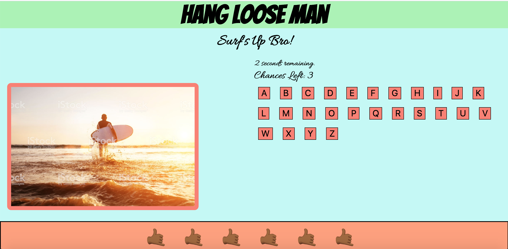
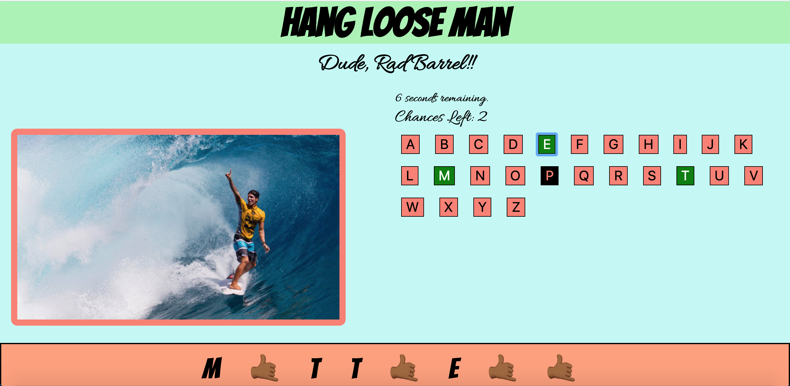
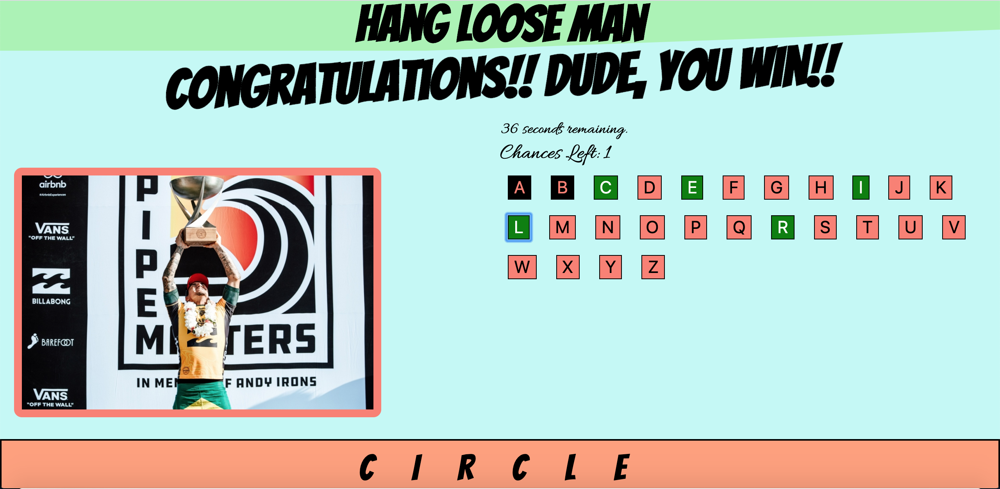

# *Hang Loose Man*

#### *By Gabriel Varella*

==>==>==>==>==>==>==>==>==>==>==>==>==>==>==>
==>==>==>==>==>==>==>==>==>==>==>==>==>==>==>

### *Date: May 14th, 2020*

==>==>==>==>==>==>==>==>==>==>==>==>==>==>==>
==>==>==>==>==>==>==>==>==>==>==>==>==>==>==>

### *Description*

The great grandfather of all games, a classic paper and pen game brought to the screen with a spin. Paddle in, hop on and hang loose, man!!!

Play Here: https://gabivarella.github.io/unit-1-project/

==>==>==>==>==>==>==>==>==>==>==>==>==>==>==>
==>==>==>==>==>==>==>==>==>==>==>==>==>==>==>

### *Drafts, Screenshots and Progression*

==>==>==>==>==>==>==>==>==>==>==>==>==>==>==>
==>==>==>==>==>==>==>==>==>==>==>==>==>==>==>

### *Technologies Used*

HTML, CSS, Javascript

==>==>==>==>==>==>==>==>==>==>==>==>==>==>==>
==>==>==>==>==>==>==>==>==>==>==>==>==>==>==>

### *User Stories*

*"Tommy is laid-backsurfer dude that likes to relax catching waves and sharpen his vocabulary learnign new words. Tommy's score is getting pretty high."*

*"Burt is a middle age, successful writer that likes to unwind testing his knowledge in way he can. Burt is getting hooked on Hang Loose Man."*

*"Leilani is a middle schooler that wants to grow up to have her own law firm. She tears it up on her board and also wants to grow her vocabuary. Leilani can have it all."*

==>==>==>==>==>==>==>==>==>==>==>==>==>==>==>
==>==>==>==>==>==>==>==>==>==>==>==>==>==>==>

### *Getting Started*

Select dificulty by clicking on one of the 3 difficulty buttons. Easy(Rio de Janeiro), Medium(Teahupo'o) and Hard(Pipeline). Easy will give you a up to 5 letter word, medium a between 5 and 8 letter word and hard will give you a 8 and up letter word. You have only 60 seconds to guess the secret word. When time is up you wipe out. Only the guttiest have dared to brave the waves of Pipiline. Give your best shot and have fun!!!

==>==>==>==>==>==>==>==>==>==>==>==>==>==>==>
==>==>==>==>==>==>==>==>==>==>==>==>==>==>==>